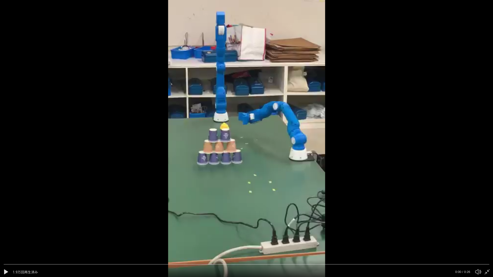

# crane_x7_examples

CRANE-X7のためのパッケージ、 `crane_x7` で用いるサンプルをまとめたパッケージです。

### まずブランチを移動

以下のコマンドでブランチを移動します。

```sh
cd catkin_ws/src/crane_x7_ros
git checkout unko
```

### 実機を使う場合

実機で動作を確認する場合、
CRANE-X7から20cm離れた位置に投げたいうんこを以下の写真のように設置します。


制御信号ケーブルを接続した状態で次のコマンドを実行します。
```sh
sudo chmod 777 /dev/ttyUSB0
roslaunch crane_x7_control crane_x7_control.launch
```

### Gazeboを使う場合

次のコマンドで起動します。実機との接続やcrane_x7_bringupの実行は必要ありません。

```sh
roslaunch crane_x7_gazebo crane_x7_with_table.launch
```

## 実行方法

---

### unko_pitching1-1.pyの実行

実機でうんこを右投げにするか左投げを選択して投げるコードです。

うんこを設置した後、次のコマンドで実行します。

```sh
rosrun crane_x7_examples unko_pitching1-1.py
```

動作させると[こちら](URL)のような動きになります。


---

### unko_pitching2-1.pyの実行

実機でうんこを右投げにするか左投げをランダムで決めて投げるコードです。

うんこを設置した後、次のコマンドで実行します。

```sh
rosrun crane_x7_examples unko_pitching2-1.py
```

動作させると[こちら](URL)のような動きになります。

---

### unko_pitching1-2.pyの実行

Gazebo上でうんこを右投げにするか左投げを選択して投げるコードです。

Gazebo起動後、次のコマンドで実行します。

```sh
rosrun crane_x7_examples unko_pitching1-2.py
```

動作させると[こちら↓](https://t.co/Ol9FSAa7HN?amp=1)のような動きになります。  
[](http://www.youtube.com/watch?v=TcwhWNa3hJ4)

---
### unko_pitching2-2.pyの実行

Gazebo上でうんこを右投げにするか左投げをランダムで決めて投げるコードです。

Gazebo起動後、次のコマンドで実行します。

```sh
rosrun crane_x7_examples unko_pitching2-2.py
```

動作させると[こちら↓](https://t.co/6eMmfampnu?amp=1)のような動きになります。  
[](http://www.youtube.com/watch?v=mw6Cfv1ABo4)

## おまけ

あるグループと繋げると・・・？[動画はこちら↓](https://twitter.com/robo_cit/status/1201399538541400064)のような動きになります。  
[](https://twitter.com/robo_cit/status/1201399538541400064/video/1)

紙コップタワーのコードは[こちら](https://github.com/GakuKuwano/crane_x7_ros/tree/master)にあります。
